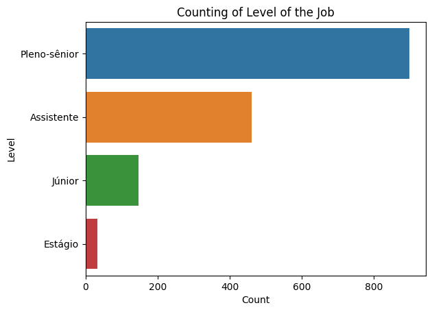

# Analysis of Job Offers

> This project aims to analyse job opportunities related to the field of data analysis. The data was collected through the web scraping of Linkedin, which was then treated and analysed. It is a useful dataset to understand what is expected when a company searches for a employee in the field, what they usually understand as related to it, and what to focus in your job searching. I intend to expand the project so that people in other areas can also find useful insights in their professions.

## Prerequisites
If you intend to test the scraper in your machine, make sure you have the following dependencies installed:
- Selenium
- Pandas
- Numpy

## How to run the project
- git clone https://github.com/alexaiung/job_scraper_and_analyzer

## Webscraping
The scraping was done through Selenium, visiting each page for a given query result in Linkedin. All the data was collected from the presented info on the site. The only information that required to go out of Linkedin was to get the link of the application. The scraper is capable of doing similar searches and saving the data for other query results. This is interesting for composing a larger dataset on data analysis positions or to start researching other positions.

## Composition of the Dataset
The job opportunities found in the Linkedin site were transformed accordingly, making it easier to analyze it. After cleaning, we have 1538 records and 19 columns. We also derived a secondary dataframe with information about all the skills associated with those 1538 job opportunities, which led us to 2667 rows, i. e. the skills required.

For the purposes of this study, the data was collected in the beginning of June. More solid results will be presented when I collect more data.

A more flexible data cleaning was made to train a Bertopic model. I didn't exclude all the data that was duplicated or missing values, since the model only needed the data from the columns 'position' and 'description'. After an initial exploratory analysis, you will see what we could learn with the grouping of the data.

## Exploratory Analysis

### Wordcount

The top-15 words most mentioned in job positions related to data analysis are the above. Below, a wordcloud with the same intention. The top-5 words are pretty related to the field: words 1 and 3 to 5 are just the english and portuguese words for data analyst. It is interesting, however, the relevance of the word 'engineer', showing that a lot of companies that search for data-related profesionals are actually looking for data engineers. This is also relevant in the case of the word 'developer', showing a strong connection between the fields. The only word related directly to a specific hard skill is 'python'.

### Type of workplace

Though inplace and hybrid modalities of work are more frequent, there is a relative proximity between the 3 categories. That means that there is a diversity in the types of jobs available.

### Level

More than half the jobs are offered to senior-level professionals ('pleno-sênior'). After that, there is the assistant level with approximately a quarter of the jobs. The rest of the opportunities are for junior and internship level, but they are the minority. Executive and director levels were ommited because there were not a lot of job opportunities for these levels available.

### Worktype

Almost all jobs are full-time. There is a relevant amount of jobs classified as 'contract', which means they probably are paid by project, and not by hours. The remaining types are very non-representative.

### Location

The city of São Paulo and São Paulo state are the main locations associated to the jobs. The second place is very distant from it, which is pretty understandable. São Paulo is the main economical center of Brazil. Besides that, since data analyst jobs don't necessarily need the proximity of the professional, the companies might be located there and offer opportunities for all the country. The remaining top cities and states are also those which have the most prominent economy - namely, those in the southeast and southern region of Brazil. The presence of the northeastern state of Bahia and its capital, Salvador, is relevant since it shows a state outer of the main economical region; its presence, however, is very low compared to São Paulo and Rio de Janeiro.

#### Location - Without remote jobs

A possible explanation for part of the great quantity of job offers in the city of São Paulo is that the companies offering them could be registering the jobs as being in São Paulo, even if the jobs are remote. This means effectively that the job is in any place of Brazil, so let's see if the difference between São Paulo and the second-city changes when we disconsider the remote opportunities:

The graphs show that São Paulo continues to be the most frequent city; however, some of the difference between it and the second-place cities is lessened. Regardless, our theory is mainly debunkered, since there are in fact a lot of in-place job positions in São Paulo.

## Skill Analysis

The following graph shows the most asked skills in the jobs analysed. It is interesting that most of them are not hard skills, but soft ones like communication, analytical skills, problem solving, and generic ones like data analysis, databases, computer science etc. This makes sense since soft skills are most likely to be shared by more offers, while hard skills tend to be more specific to each position. SQL and Python are the most relevant hard skills, followed by Excel, Java and Microsoft Office.

If we look the top-10 most asked skills by the type of workplace, we see that:
- Remote jobs asks for English, SQL, Python, Computer Science, and Data Science
- In-person and hybrid jobs asks for analytical skills, communication, data analysis, and problem solving
- All of the job types asks for database skill.

Computer Science and Data Science are more specialized jobs; companies are more willing to rely on this knowledge when they hire someone who works remotely. They also asks for english since they must be international companies. In-person and hybrid jobs asks more frequently for themes related to convivence in a company - namely, data analysis is best done when you are immersed in a work environment. You also have a greater need for a good communication and problem solving skills when dealing with other employees.

### Skills categorization

Using ChatGPT, we created a classification of the most required skills in four categories.
Analytical skills are the most required. The categories are:

Analytical skills are the most required type of skills. This makes sense, since we are searching for a data analysis job. Even if we find a developer position, it does make sense to expect a certain level of analytical expertise. This general category is subdivided between several subtypes, but we can see in the top-5 that they are main areas of analytical knowledge. Solve-problem is an exception; since most of the jobs are for in-place positions, it makes sense that the professional should be able to deal with problems.

Technologies are the second most frequent category. It is interesting the relevance of database skill, something that people intending to enter the data analysis market should focus. Above, we have also seen that database skill is asked in all types of positions: remote, in-place or hybrid. Besides that, Microsoft Excel and Office are very required - Excel is, after all, the main data analysis tool in the market, even if there are more sophisticated technologies.

In the communication category, it is important to know how to communicate - something very usual in most of the jobs. English is a main requirement too, which is very understandable, though we have seen that this is a rule more frequent in remote positions. Not only a lot of companies are from other countries, but there are also Brazilian companies that have international partnerships.

Finally, when we see the most required programming languages, we see the predominance of SQL - which is directly related to the requirement of database knowledge seen above - and Python, the main data analysis language in the market. It is interesting, however, the presence of Java and Javascript in a relatively high demand. We will see later the reason for that.

# Bertopic

Our dataset was filtered by Bertopic, resulting in 49 topics. We are going to see below the top-10 most relevant topics, and I will comment on the remaining ones that seems more relevant. The names of the topics were given using ChatGPT 3.5.

The top-10 topics all have more than 30 jobs under their categories. The most frequent of all has 82 jobs. Let's think about its keywords.

<table border="1" class="dataframe">
  <thead>
    <tr style="text-align: right;">
      <th>title</th>
      <th>Topic</th>
      <th>Representation</th>
    </tr>
  </thead>
  <tbody>
    <tr>
      <td>Data Analytics Engineer</td>
      <td>0</td>
      <td>['databases', 'databricks', 'data', 'analytics', 'pipeline', 'pipelines', 'engineer', 'architecture', 'cloud', 'processing']</td>
    </tr>
    <tr>
      <td>BI Analyst</td>
      <td>1</td>
      <td>['analyst', 'bi', 'analytical', 'reports', 'dashboards', 'insights', 'database', 'data', 'analysis', 'sql']</td>
    </tr>
    <tr>
      <td>E-commerce Analyst</td>
      <td>2</td>
      <td>['customers', 'analyst', 'business', 'customer', 'sales', 'commerce', 'company', 'role', 'market', 'production']</td>
    </tr>
    <tr>
      <td>Cybersecurity Analyst</td>
      <td>3</td>
      <td>['cybersecurity', 'security', 'analyst', 'firewalls', 'certification', 'cisco', 'firewall', 'management', 'infrastructure', 'skills']</td>
    </tr>
    <tr>
      <td>SAP Consulting Developer</td>
      <td>4</td>
      <td>['consulting', 'sap', 'business', 'customers', 'development', 'services', 'company', 'capabilities', 'accenture', 'career']</td>
    </tr>
    <tr>
      <td>SAP Engineering Intern</td>
      <td>5</td>
      <td>['internship', 'intern', 'engineering', 'sap', 'requirements', 'develop', 'development', 'opportunities', 'rina', 'projects']</td>
    </tr>
    <tr>
      <td>Logistics Manager</td>
      <td>6</td>
      <td>['logistics', 'responsibilities', 'freight', 'management', 'inventory', 'manage', 'operational', 'production', 'transport', 'process']</td>
    </tr>
    <tr>
      <td>Lab Analyst</td>
      <td>7</td>
      <td>['laboratory', 'certification', 'inspection', 'management', 'services', 'analyst', 'manufacturing', 'opportunities', 'production', 'vacancy']</td>
    </tr>
    <tr>
      <td>Java Developer</td>
      <td>8</td>
      <td>['developer', 'development', 'career', 'vacancy', 'java', 'requirements', 'backend', 'architecture', 'professionals', 'technical']</td>
    </tr>
    <tr>
      <td>Clinical Analyst</td>
      <td>9</td>
      <td>['dasa', 'analyst', 'clinical', 'studies', 'medical', 'qualifications', 'patients', 'health', 'management', 'analysis']</td>
    </tr>
  </tbody>
</table>

The number one topic in frequency ('Data Analytics Engineer') has keywords such as 'databases', 'data', 'analytics', and 'processing'. These categories are pretty general, related to most of data analysis field; but we also have some more specific categories, such as 'pipeline', 'engineer', 'architecture', and 'cloud'. This means that the most searched professional in the area is that one who has knowledge of cloud architecture, and is capable of creating pipelines.

Following that, we have a category all about Business Intelligence, a main area where data analysts work. This is easy to see, since we have keywords like 'bi', 'reports', 'dashboards', and 'sql', all related to BI.

The third topic - E-commerce Analyst - is about sales and customers; not only this is one of the keywords, but the remaining are related with 'market', 'commerce', and 'production', all areas that, even if are close to BI, tend to differentiate from it, and from BI Analyst position, which is more technical.

It is interesting that the fourth topic is about cybersecurity, an area that can be relatively close to data analysis, but has a different set of skills.

The remaining topics are about SAP tools and customers relationship; internship and SAP tools; logistics and transport; lab analysis; Java development; and clinical analysis.

The presence of a large quantity of development jobs (the ninth topic) explains the presence of Java as a relevant programming language in our previous analysis. This language is not usually related with data analysis, and only gained prominence thanks to the presence of a diversity of development jobs in our dataset.

When we see the probability of a job in being categorized in a specific topic, filtering by the type of workplace, we get some interesting information.

First of all, most of remote positions are categorized as Data Analysts Engineers. This is the first topic we have seen, related to data analysis, and cloud architecture. Technologies such as Google Cloud and AWS are required from professionals who are going to work remotely. This makes sense in the first place because they will have to deal with cloud computing, since they are not in the computer of the company. However, these technologies are relevant regardless of this fact.

The inplace positions and hybrid positions are more related with BI Analysis. This confirms our hypothesis previously stated: that data analysis is best done in the convivence with other employees and in the day-to-day of a company. We have seen that when we checked the most asked skills for in-place professionals.

Above, we have the top-5 topics associated with each modality of work. Besides the top-1, which was already discussed, we can see that remote positions have a higher presence of developing positions. In-place jobs are focused in another set of jobs, which does not coincide with the remote positions - in general, we are talking of BI and commerce-related jobs. Hybrid positions are hybrid also in its topics; it has the presence of the main topic of the categories remote and in-place. However, the remaining categories are mainly related with in-place positions, with the exception with SAP consulting developer which is exclusive to hybrid positions.

Full-time jobs tend to be related with the Data Analysis engineer positions. Hiring a remote professional requires that you can trust in them, which usually will ask for more qualification and hard skills. However, it is important to notice that the probability is relatively low, showing that there are other topics which can categorize full-time jobs.

The 'SAP engineering intern' is the most relevant in three work types: temporary, half-time, and internship. This topic has the keyword 'internship' in it, showing that we are talking about jobs which are directed to interns. These are development jobs, related with projects, and also with SAP tools. It is interesting that these three categories - intern, temporary, and half-time - tend to receive less payment, and be less reliable in terms of long-time partnership.

Finally, we have a huge tendency that contract jobs are part of Football Statistician category. This topic is part of a series of job offers related with statistician analysis on football and sports, mainly from Genius company. Since they offer a lot of vacancies, they managed to obtain a topic just for them! Most of them are contract jobs, which explains the high probability of contract-type jobs being inserted here.

Since the full-time category is the one with more jobs offers, let's explore it.

Besides Data Analytics Engineer, full-time positions have also the BI analyst position - the position that was more frequent in in-place jobs. This 5 positions are all more technical, demanding a professional that understands Data Analysis so they can use it with different intents - BI, Database analysis, Market Analysis etc.

Data analytics engineer is the highest probability for senior and assistant jobs. It is interesting that this category involves people with more experience, and those who are less capacitated. The companies probably think that, as long as the person has the skills on data analysis, and cloud architecture, it should be enough.

Topic 'BI analyst' is where most of junior jobs are inserted. This means that Data Analysts who works with BI, elaborating dashboards, and reports, tend to be of a entry-level, and those professionals who advance in their careers tend to be involved in other areas of data analysis - maybe more technical.

Topic 'SAP engineering intern' is where are the internships; we have already explored this in the previous chart.

---

Through the manipulation of the dataset, we can see the probability of a certain skill to be associated with a specific topic. We can see the main ones following. Note that not all topics have graphs. This was necessary to avoid errors: the probability tends to be high if the skill is required only in few positions; however, we can't trust the data if there are not enough quantity of the information. Curiously, this means that a topic that have a relatively high frequency, such as the topic 3 - cybersecurity, tends to ask for skills that are not usually required in other jobs. This means that we can't really suppose that those skills are representative, therefore they were ommitted.

The comparison between the top two categories is very relevant, since they were already divergent in the type of workplace. The topic 0, 'Data Analytics Engineer', asks for more hard skills, such as PLN, Python, SQL, and Java. It is also relevant the requirement of knowledge in English, since we already saw that a lot of these positions are remote. On the other hand, BI Analysts are required to know more soft skills, a lot of data manipulation and visualization techniques, and not so much hard skills. This is pretty representative of the nature of these jobs.

The E-commerce analyst is also very related to soft skills; however, they need to know about SAP tools, and about sales. The Business Data Analyst is a position similar to BI Analyst, but has a stronger presence of sales-related topics. Developer positions, on the other hand, asks mainly for hard skills.

